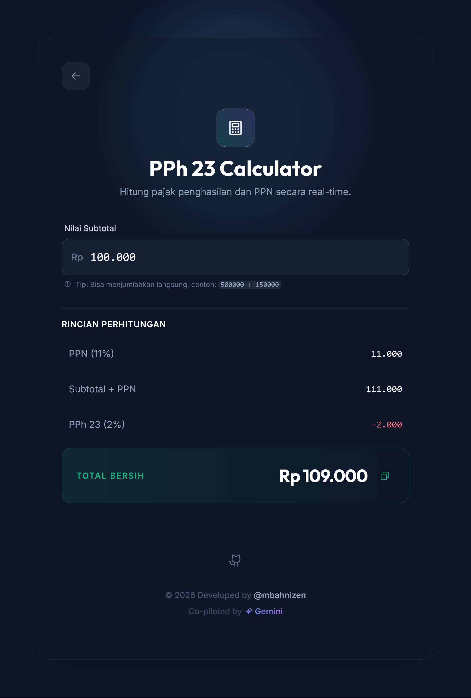

# 💸 Kalkulator PPh 23 Online



**Kalkulator pajak PPh 23 Indonesia yang cepat, aman, dan mudah dipakai — tanpa perlu hapus titik atau format angka manual.**

[](https://github.com/mbahnizen/pph23-calculator/releases)
[](https://apps.nizen.my.id/pph23-calculator)
[](https://php.net)
[](https://github.com/mbahnizen/pph23-calculator/actions)
[](LICENSE)

---

## 💡 Kenapa Kalkulator Ini Dibuat?

Banyak orang Indonesia butuh hitung PPh 23 — untuk jasa, sewa, dividen, atau royalti. Tapi kebanyakan tools online punya masalah yang sama:

| Masalah Umum | Solusi Kami |
| --- | --- |
| ❌ Harus hapus titik & format angka manual | ✅ Langsung ketik `1.000.000` — otomatis dipahami |
| ❌ Berat, lambat, pakai framework besar | ✅ Ringan & instan, tanpa loading lama |
| ❌ Tidak nyaman di HP | ✅ Responsif — nyaman di HP maupun laptop |
| ❌ Pakai `eval()` yang rawan disalahgunakan | ✅ Parser aman buatan sendiri, tanpa celah keamanan |

> [!TIP]
> Bisa langsung menjumlahkan di kolom input! Contoh: ketik `500.000 + 150.000` dan hasilnya langsung dihitung otomatis.

---

## ✨ Fitur Utama

- ⚡ **Hitung instan** — hasil muncul langsung saat mengetik, tanpa perlu klik tombol
- 🇮🇩 **Format angka Indonesia** — pakai titik sebagai pemisah ribuan, koma untuk desimal
- 🧮 **Ekspresi matematika** — dukung penjumlahan langsung di kolom input
- 📋 **Salin hasil** — satu klik untuk copy hasil ke clipboard
- 🖨️ **Siap cetak** — tampilan dioptimasi untuk print langsung dari browser
- 🔒 **Input aman** — semua input disanitasi, tidak ada risiko injeksi kode

---

## 🧾 Cocok Untuk Siapa?

- 👨‍💼 Freelancer & pekerja lepas
- 📊 Staff finance / accounting
- 🏢 Pemilik bisnis & UMKM
- 📋 Konsultan pajak
- 🙋 Siapa pun yang butuh **hitung PPh 23 dengan cepat & akurat**

---

## 🏗️ Bagaimana Cara Kerjanya?

Arsitektur dibuat modular supaya mudah di-maintain dan aman:

```text
User Input
    ↓
[ NumberParser ]  →  Mengubah format Indonesia (1.000.000,50) jadi angka biasa
    ↓
[ TaxCalculator ] →  Menghitung PPh 23 & PPN berdasarkan tarif resmi
    ↓
[ Alpine.js UI ]  →  Menampilkan hasil secara real-time di browser
```

> [!NOTE]
> Semua perhitungan juga dijalankan di sisi server (PHP) sebagai sumber logika utama. Alpine.js hanya mirror di sisi client untuk kecepatan UI.

---

## 🛠️ Tech Stack

| Teknologi | Fungsi |
| --- | --- |
| **PHP 8.1+** | Backend & logika perhitungan pajak |
| **Alpine.js** | UI reaktif ringan (~15kB) untuk update real-time |
| **Tailwind CSS** | Styling modern dengan dark theme |
| **PHPUnit** | Unit testing untuk memastikan akurasi hitung |

---

## 🧪 Testing

Kalkulator pajak harus **100% akurat** — satu desimal salah bisa bikin laporan keuangan keliru.

```
✅ 23 tests, 40 assertions — semua passed
✅ Coverage 100% pada service & helper classes
✅ Tested: angka besar, presisi desimal, input berbahaya, format salah
```

<details>
<summary>📋 Lihat output PHPUnit lengkap</summary>

```bash
$ ./vendor/bin/phpunit
PHPUnit 10.5.63 by Sebastian Bergmann and contributors.

.......................                                 23 / 23 (100%)

Time: 00:00.031, Memory: 8.00 MB
OK (23 tests, 40 assertions)
```

</details>

---

## 🚀 Quick Start

### Prasyarat

- PHP 8.0+
- Composer
- Node.js (untuk build CSS saja)

### Instalasi

```bash
git clone https://github.com/mbahnizen/pph23-calculator.git
cd pph23-calculator

composer install
npm install
npm run build:css
```

### Jalankan

```bash
php -S localhost:8000 -t public/
```

Buka [http://localhost:8000](http://localhost:8000) di browser.

<details>
<summary>🔧 Development mode (live CSS reload)</summary>

```bash
npm run watch:css
```

</details>

---

## 🌐 Deployment

Siap deploy ke Nginx / PHP-FPM. Lihat [INSTALL.md](INSTALL.md) untuk konfigurasi lengkap.

---

## 📌 Kata Kunci Terkait

Kalkulator ini relevan untuk pencarian seperti:

`kalkulator PPh 23 online` · `cara menghitung PPh 23` · `hitung pajak PPh 23 Indonesia` · `rumus PPh 23 jasa` · `PPh 23 berapa persen` · `kalkulator pajak perusahaan`

---

## 📄 Lisensi

MIT © [mbahnizen](https://github.com/mbahnizen)
